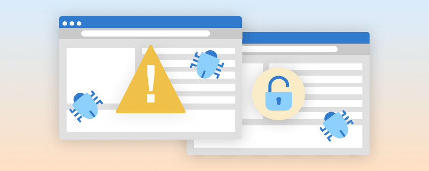
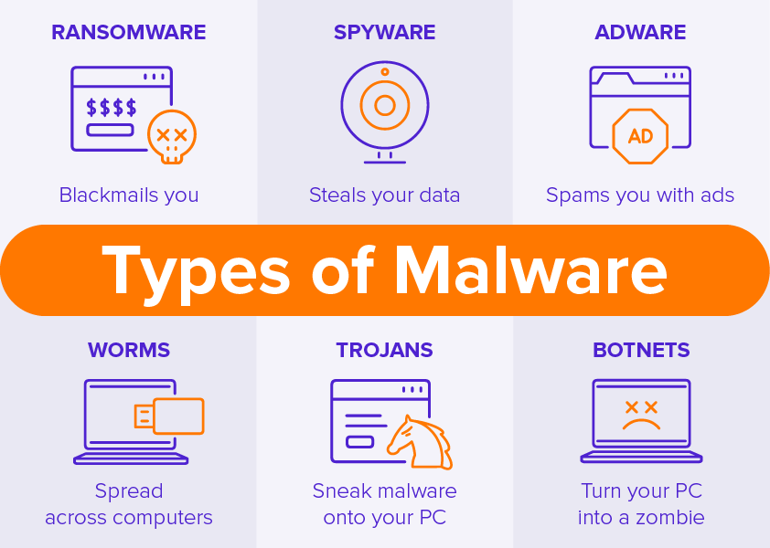
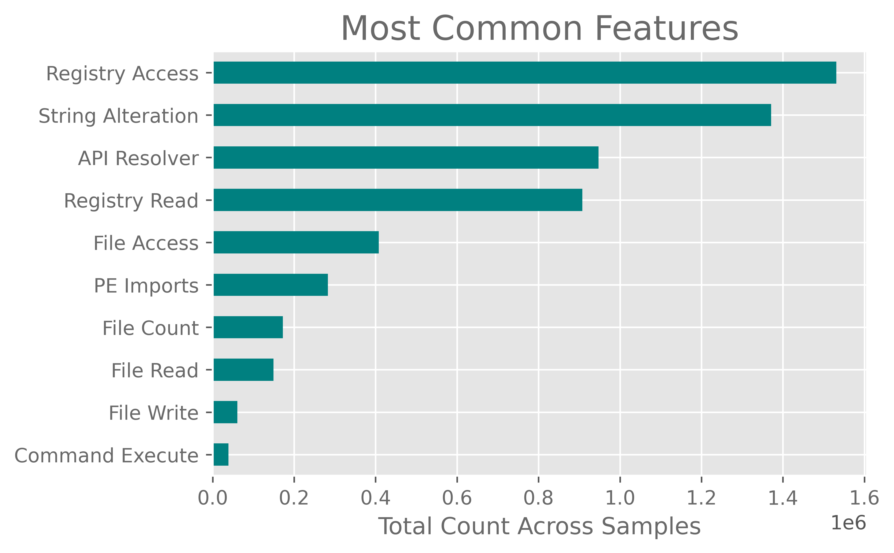

# Malware Classification

## Motivation and Background

### Overview
 Malware and cyber attacks are a persisting concern for businesses, governments, and individuals.  Currently, there are two major ways for identifying malware, static and dynamic.  Static identification uses patterns and processes within the code to catch malware.  Dynamic uses the actions or "behaviors" of the malware to identify it.  NLP and other machine learning models are common in identifying static features of code for threats, however, dynamic identification is less utilized with machine learning. Another reason dynamic analysis is sometimes not used is the risk of malware infecting the computer testing it.  For this reason, it is common to test the malware in a "sandbox" environment.  This is a virtual computer or network that mimics a real one in order to watch what malicious code does without risking a computer or network from harm. Of note, some malware has ways around these safeguard. One of the reasons to "featurize" system calls is to make the malware code "safe".  Another is to apply machine learning for better understanding and classification of these instances.  

### Types

 There are hundreds of varieties of malware, but for purposes of scope I will be focusing on ransomeware, keyloggers, and advanced percistent threats.  Ransomeware takes control of a computer, network, or system and the owner is expected to pay a "ransom" to regain control.  Keyloggers record all keystrokes or inputs to gain important credentials, private information, and other entered data.  Advanced persistent threats are programns that get installed undetected and collect data for an extended period of time.  They tend to be fairly complex in design or coding.
 
 ### Objective
 One of the most important things that can be done to combat this threat is to stop malicious code and processes before they can do major harm or collect important data.  A relatively unexplored way of doing this is classifying malware through machine learning on both static and dynamic features. My objective though this project is to see if it is possible to predict malware type using static and dynamic feature based machine learning with a decent degree of accuracy.

## Data Source and Intake

In research, I discovered a method of accomplishing featurized system call data called Malware Instructional Set or MIST. (Paper found [here](http://www.mlsec.org/malheur/docs/mist-tr.pdf).)  Put simply, it takes the components of a system call and abstracts them through string into features. Please see example below:

As described above, running malware in a sandbox will produce these system calls.  The sandbox used for this dataset was [Cuckoo](https://cuckoo.sh/docs/#).  These MIST representations are then saved as JSON files.  Each file representing an instance of malware. Here is one such instance:

I decided to utilized MongoDB to compile all of the malware instances into a database because of the complexity and lack of overall structure. From there, it was pulled down in to a Pandas DataFrame and rearranged to fit a format that would appropriately represent every feature.  Below are two abriviated row examples of the mentioned malware instances.  The entityId is an instance identifier and following columns are the features.  Features without MIST attributes were assigned a value of zero.

## EDA

After data cleaning was complete, the resulting dataset was comprized of 4762 sample with 139 features and 4 target classes.  Here are the class counts and some of the most commonly occuring actions or attributes of the samples:

 

The target class imbalance is definitely a cause for concern that will be addressed in later versions of this project.  Additionally, further explaination of feature meaning to be added.

## Modeling

 - Classification
 - Feature importance
 - Confusion Matrix

I decided to use Gradient Boosted Classification for multi-class classification because of the different types of malware being assigned with a high number of features.

After some hyperparameter tuning with Random and Halving Grid Search Cross Validation,  I was able to achieve an overall approximate score of 0.77 for accuracy.  Below are additional stats on the model attained:

Given the results, additional context was needed so I ran a confusion matrix to see how targets were being predicted.

With the current model, this shows the keylogger (Zeus) being mistaken for ransomeware (Crypto) a little over a third of the time.

## Conclusion and Future Work

Overall, the model performs fairly well on the unseen data.  It predicts well for advanced persistent threats, crypto ransomware, and locker ransomware.  Although this is a good start, I believe there is much optimization to be accomplished with this project.

### Future Work

 - There is still work that needs to be done to separate the keylogger Zeus

 - Adding more balancing to the classes is another avenue to increase performace because the class sizes vary significantly

 - Reducing the number of features is also part of the future concept for this project

 - In similar concept to the previous bullet, feature manipulation with some of the static features could prove useful in better classification

### Credits and References

Recognition and thanks to Kayla Thomas, Chris Reger, Jessica Curley and Ian Hetterich for assistance and direction throughout this project.

#### Data: Publicly hosted dataset for research

    @misc{ MR,
        author = "Marco Ramilli",
        title = "Malware Training Sets: a machine learning  dataset for everyone",
        year = "2016",
        url = "https://marcoramilli.com/2016/12/16/ malware-training-sets-a-machine-learning-dataset-for -everyone/",
        note = "[Online; December 2016]"
    }

#### M.I.S.T : Scholar article on "MIST" process and concept

 - Title: "A Malware Instruction Set for Behavior-Based Analysis" 

 - Authors: Philipp Trinius, Carsten Willems, Thorsten Holz, and Konrad Rieck

 - From: University of Mannheim, Germany; Vienna University of Technology, Austria; and Berlin Institute of Technology, Germany (respectively)

 - [Web Article PDF](http://www.mlsec.org/malheur/docs/mist-tr.pdf)

Cuckoo Sandbox: Open-source sandboxing software

 - [Website](https://cuckoo.sh/docs/#)

Images:

 - Header: MalwareBytes - [link](https://www.malwarebytes.com/malware/)
 - Types: Avast - [link](https://www.avast.com/c-malware)

